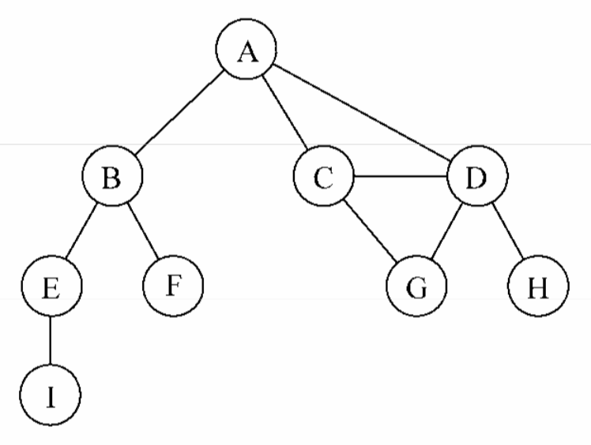
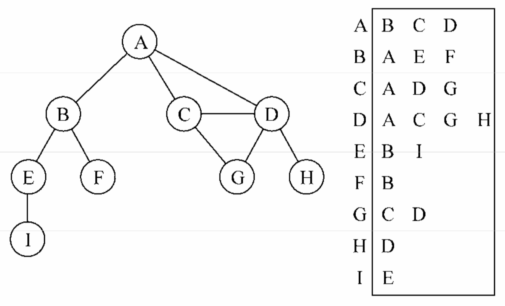

# 图

> 图是网络结构的抽象模型。图是一组由边连接的节点(或顶点)，任何二元关系都可以用图来表示。

## 图的相关术语

一个图 G = (V, E)由以下元素组成：

- V:一组顶点
- E:一组边，连接V中的顶点



- **相邻顶点**：由一条边连接在一起的顶点称为相邻顶点。比如，A和B是相邻的，A和D是相邻的，A和C是相邻的，A和E不是相邻的。
- **度**：一个顶点的度是其相邻顶点的数量。比如，A和其他三个顶点相连接，因此，A的度为3;E和其他两个顶点相连，因此，E的度为2。
- **路径**：路径是顶点v1, v2,...,vk的一个连续序列，其中vi和vi+1是相邻的。以上一示意图中的图为例，其中包含路径A B E I和A C D G。
- **简单路径**：简单路径要求不包含重复的顶点。举个例子，A D G是一条简单路径。除去最后一个顶点(因为它和第一个顶点是同一个顶点)，**环**也是一个简单路径，比如A D C A(最后一个顶点重新回到A)。如果图中不存在环，则称该图是**无环**的。如果图中每两个顶点间都存在路径，则该图是**连通**的。
- **有向图与无向图**：图可以是**无向**的(边没有方向)或是**有向**的(有向图)。如果图中每两个顶点间在双向上都存在路径，则该图是**强连通**的。
- **加权与未加权**：图还可以是**未加权**的或是**加权**的。加权图的边被赋予了权值。

## 图的表示

1. 邻接矩阵

    每个节点都和一个整数相关联，该整数将作为数组的索引。

2. 邻接表

    邻接表由图中每个顶点的 **相邻顶点列表** 所组成。我们可以用列表(数组)、链表，甚至是散列表或是字典来表示相邻顶点列表。

    

3. 关联矩阵

    在关联矩阵中，矩阵的行表示顶点，列表示边。

    关联矩阵通常用于边的数量比顶点多的情况下，以节省空间和内存。

## 创建图类

```js
function Graph() {
    var vertices = []; // 数组 存储图中所有顶点的名字
    var adjList = new Dictionary(); //字典 存储邻接表(顶点的名字作为键，邻接顶点列表作为值)

    // 向图中添加一个新的顶点
    this.addVertex = function(v){
       vertices.push(v); // 将顶点添加到顶点列表中
       adjList.set(v, []); //顶点为键，字典值为空数组
    };
    // 添加边
    this.addEdge = function(v, w){  // 接受两个顶点作为参数
        adjList.get(v).push(w); //基于有向图
        adjList.get(w).push(v); //基于无向图
    };
    // 在控制台展示
    this.toString = function(){
        var s = '';
        for (var i=0; i<vertices.length; i++){
            s += vertices[i] + ' -> ';
            var neighbors = adjList.get(vertices[i]);
            for (var j=0; j<neighbors.length; j++){
                s += neighbors[j] + ' ';
            }
            s += '\n';
        }
        return s;
    };
}

```

```js
// 测试
var graph = new Graph();
var myVertices = ['A','B','C','D','E','F','G','H','I'];
for (var i=0; i<myVertices.length; i++){
    graph.addVertex(myVertices[i]);
}
graph.addEdge('A', 'B');
graph.addEdge('A', 'C');
graph.addEdge('A', 'D');
graph.addEdge('C', 'D');
graph.addEdge('C', 'G');
graph.addEdge('D', 'G');
graph.addEdge('D', 'H');
graph.addEdge('B', 'E');
graph.addEdge('B', 'F');
graph.addEdge('E', 'I');
console.log(graph.toString());

// 结果如下：
A -> B C D
B -> A E F
C -> A D G
D -> A C G H
E -> B I
F -> B
G -> C D
H -> D
I -> E
```

## 图的遍历

有两种算法可以对图进行遍历:广度优先搜索(Breadth-First Search，BFS)和深度优先搜索(Depth-First Search，DFS)。图遍历可以用来寻找特定的顶点或寻找两个顶点之间的路径，检查图是否连通，检查图是否含有环等。

|算 法|数据结构|描 述
---|---|---
深度优先搜索|栈|通过将顶点存入栈中，顶点是沿着路径被探索的，存在新的相邻顶点就去访问
广度优先搜索|队列|通过将顶点存入队列中，最先入队列的顶点先被探索

当要标注已经访问过的顶点时，我们用三种颜色来反映它们的状态：

- 白色:表示该顶点还没有被访问。
- 灰色:表示该顶点被访问过，但并未被探索过。
- 黑色:表示该顶点被访问过且被完全探索过。

```js
// 辅助函数 初始化
var initializeColor = function(){
  var color = [];
  for (var i=0; i<vertices.length; i++){
      color[vertices[i]] = 'white'; // 当算法开始执行时，所有的顶点颜色都是白色
  }
  return color;
};
```

### 广度优先搜索

广度优先搜索算法会从指定的第一个顶点开始遍历图，先访问其所有的相邻点，就像一次访问图的一层。换句话说，就是**先宽后深**地访问顶点，如下图所示:

```js
/**
 * v 顶点，作为算法的起始点
 * callback 回调
 */
this.bfs = function(v, callback){
    var color = initializeColor(), // 将color数组初始化为white
        queue = new Queue(); // 创建一个队列 存储待访问和待探索的顶点
    queue.enqueue(v); // 将顶点入队列
    while (!queue.isEmpty()){ // 队列非空
        var u = queue.dequeue(), //出队列
            neighbors = adjList.get(u); //取得u顶点的邻接表
        color[u] = 'grey'; //发现了但还未完成对其的搜素，标注为grey
        for (var i=0; i<neighbors.length; i++){
            var w = neighbors[i]; //u每个顶点名
            if (color[w] === 'white'){
                color[w] = 'grey'; //发现了它
                queue.enqueue(w); //入队列循环
            }
        }
        color[u] = 'black'; //已搜索过
        if (callback) {
            callback(u);
        }
    }
};
```

```js
//测试如下：
function printNode(value){
    console.log('Visited vertex: ' + value);
}
graph.bfs(myVertices[0], printNode);
// 结果如下：
Visited vertex: A
Visited vertex: B
Visited vertex: C
Visited vertex: D
Visited vertex: E
Visited vertex: F
Visited vertex: G
Visited vertex: H
Visited vertex: I

```

#### 使用BFS寻找最短路径

> 给定一个图G和源顶点v，找出对每个顶点u，u和v之间最短路径的距离(以边的数量计)

```js
this.BFS = function(v){
  var color = initializeColor(),
      queue = new Queue(),
      d=[], // 声明数组d来表示距离
      pred = []; // 声明数组pred来表示前溯点
  queue.enqueue(v);
  for (var i=0; i<vertices.length; i++){
      d[vertices[i]] = 0;                //用0来初始化数组d
      pred[vertices[i]] = null;          //用null来初始化数组pred
  }
  while (!queue.isEmpty()){
      var u = queue.dequeue(),
          neighbors = adjList.get(u);
      color[u] = 'grey';
      for (i=0; i<neighbors.length; i++){
          var w = neighbors[i];
          if (color[w] === 'white'){
              color[w] = 'grey';
              d[w] = d[u] + 1;  // 给d[u]加1来设置v和w之间的距离
              pred[w] = u;    // 当发现顶点u的邻点w时，则设置w的前溯点值为u
              queue.enqueue(w);
          }
      }
      color[u] = 'black';
    }
    return { // 返回了一个包含d和pred的对象
        distances: d,
        predecessors: pred
    };
}
```

```js
//测试如下：
var shortestPathA = graph.BFS(myVertices[0]);
console.log(shortestPathA);
// 结果如下：
distances: [A: 0, B: 1, C: 1, D: 1, E: 2, F: 2, G: 2, H: 2 , I: 3],
predecessors: [A: null, B: "A", C: "A", D: "A", E: "B", F: "B", G:"C", H: "D", I: "E"]
```

### 深度优先搜索

深度优先搜索算法将会从第一个指定的顶点开始遍历图，沿着路径直到这条路径最后一个顶点被访问了，接着原路回退并探索下一条路径。换句话说，它是**先深度后广度**地访问顶点，如下图所示:

```js
this.dfs = function(callback){
    var color = initializeColor(); // 初始化颜色数组
    for (var i=0; i<vertices.length; i++){
        if (color[vertices[i]] === 'white'){ // 对于图实例中每一个未被访问过的顶点
            dfsVisit(vertices[i], color, callback); //递归 传递的参数为顶点、颜色数组以及回调函数
        }
    }
};
var dfsVisit = function(u, color, callback){
    color[u] = 'grey';  // 当访问u顶点时，我们标注其为被发现的
    if (callback) {      // 执行回调
        callback(u);
    }
    var neighbors = adjList.get(u); //取得包含顶点u所有邻点的列表
    for (var i=0; i<neighbors.length; i++){
        var w = neighbors[i];
        if (color[w] === 'white'){  // 对于顶点u的每一个未被访问过的邻点w
            dfsVisit(w, color, callback); //调用dfsVisit函数,添加顶点w入栈
        }
    }
    // 在该顶点和邻点按深度访问之后，回退，意思是该顶点已被完全探索，并将其标注为black
    color[u] = 'black';
};
```