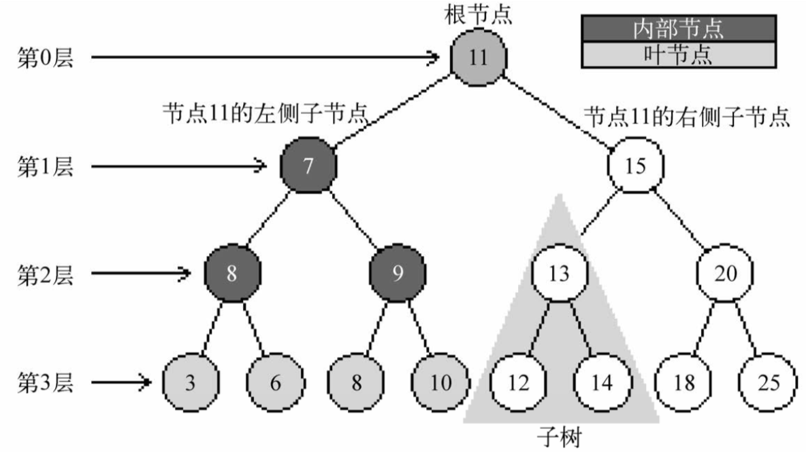

# 树

树是一种分层数据的抽象模型。现实生活中最常见的树的例子是家谱，或是公司的组织架构图。

一个树结构包含一系列存在父子关系的节点。每个节点都有一个父节点(除了顶部的第一个节点)以及零个或多个子节点:



- 根节点：位于树顶部的节点叫作根节点(11)。它没有父节点。
- 节点：树中的每个元素都叫作节点，一个节点可以有祖先和后代。节点分为内部节点和外部节点。
  - 内部节点：至少有一个子节点的节点称为内部节点(7、5、9、15、13和20是内部节点)。
  - 外部节点：没有子元素的节点称为外部节点或叶节点(3、6、8、10、12、14、18和25是叶节点)。
- 子树：子树由节点和它的后代构成。例如，节点13、12和14构成了上图中树的一棵子树。
- 深度：节点的一个属性是深度，节点的深度取决于它的祖先节点的数量。比如，节点3有3个祖先节 点(5、7和11)，它的深度为3。
- 树的高度：树的高度取决于所有节点深度的最大值。上图中的树的高度为3(最大高度已在图中表示——第3层)。
- 层级：一棵树也可以被分解成层级。根节点在第0层，它的子节点在第1层，以此类推。

## 二叉树和二叉搜索树

**二叉树** 中的节点最多只能有两个子节点:一个是左侧子节点，另一个是右侧子节点。这些定 义有助于我们写出更高效的向/从树中插入、查找和删除节点的算法。

**二叉搜索树(BST)** 是二叉树的一种，但是它只允许你在左侧节点存储(比父节点)小的值， 在右侧节点存储(比父节点)大(或者等于)的值。

我们主要研究二叉搜索树。

### BinarySearchTree基本结构

```js
function BinarySearchTree() {
    var Node = function(key){
        this.key = key;
        this.left = null;
        this.right = null;
    };
    // 根节点
    var root = null;
}
```

在双向链表中，每个节点包含两个指针，一个指向下一个节点，另一个指向上一个节点。对于树，使用同样的方式(也使用两个指针)。但是，一个指向左侧子节点，另一个指向右侧子节点。

### 插入节点

```js
this.insert = function(key){
    // 创建用来表示新节点的Node类实例
    var newNode = new Node(key);
    // 根节点为空，作为根节点
    if (root === null){
        root = newNode;
    } else {
        insertNode(root,newNode);
    }
};
// 插入节点操作辅助函数
var insertNode = function(node, newNode){
    // 比较新节点的键与当前节点的键
    if (newNode.key < node.key){
        if (node.left === null){
            // 如果没有左侧节点就插入新的节点
            node.left = newNode;
        } else {
            //有的话递归，找到树的下一层（下次将要比较的节点将会是当前节点的左侧子节点）
            insertNode(node.left, newNode);
        }
    } else {
        //如果没有右侧节点就插入新的节点
        if (node.right === null){
            node.right = newNode;
        } else {
            //有的话递归调用insertNode方法，但是要用来和新节点比较的节点将会是右侧子节点。
            insertNode(node.right, newNode);
        }
    }
};
```

### 树的遍历

访问树的所有节点有三种方式:

- 中序遍历：中序遍历是一种以上行顺序访问BST所有节点的遍历方式，也就是以**从最小到最大**的顺序访问所有节点。

    

    ```js
    // inOrderTraverse方法接收一个回调函数作为参数。回调函数用来定义我们对遍历到的每个节点进行的操作(这也叫作访问者模式)
    this.inOrderTraverse = function(callback){
        inOrderTraverseNode(root, callback);
    };
    // inOrderTraverseNode方法的实现如下:
    var inOrderTraverseNode = function (node, callback) {
        // 检查以参数形式传入的节点是否为null
        if (node !== null) {
            // 递归调用相同的函数来访问左侧子节点
            inOrderTraverseNode(node.left, callback);
            // 接着对这个节点进行一些操作 (callback)
            callback(node.key);
            // 递归调用相同的函数来访问右侧子节点
            inOrderTraverseNode(node.right, callback);
        }
    };
    ```

- 先序遍历：先序遍历是以**优先于后代节点**的顺序访问每个节点的。先序遍历的一种应用是打印一个结构化的文档。

    

    ```js
    this.preOrderTraverse = function(callback){
        preOrderTraverseNode(root, callback);
    };
    // preOrderTraverseNode方法的实现如下:
    var preOrderTraverseNode = function (node, callback) {
        if (node !== null) {
            // 先序遍历会先访问节点本身
            callback(node.key);
            // 再访问它的左侧子节点
            preOrderTraverseNode(node.left, callback);
            // 最后是右侧子节点
            preOrderTraverseNode(node.right, callback);
        }
    };
    ```

- 后序遍历：后序遍历则是先访问节点的**后代节点**，再访问节点本身。后序遍历的一种应用是计算一个目录和它的子目录中所有文件所占空间的大小。

    

    ```js
    this.postOrderTraverse = function(callback){
        postOrderTraverseNode(root, callback);
    };
    // postOrderTraverseNode方法的实现如下:
    var postOrderTraverseNode = function (node, callback) {
        if (node !== null) {
            // 会先访问左侧子节点
            postOrderTraverseNode(node.left, callback);
            // 然后访问右侧子节点
            postOrderTraverseNode(node.right, callback);
            // 最后父节点本身
            callback(node.key);
        }
    };
    ```

### 搜索树中的值

在树中，有三种经常执行的搜索类型:

- 最小值;
- 最大值;
- 搜索特定的值。

#### 搜索最小值和最大值


对于寻找最小值，总是沿着树的左边;而对于寻找最大值，总是沿着树的右边。

```js
this.min = function() {
    // 在调用minNode方法的时候传入树的根节点
    return minNode(root);
};
var minNode = function (node) {
    if (node){
       // 遍历树的左边直到找到树的最下层(最左端)
        while (node && node.left !== null) {
             node = node.left;
        }
        return node.key;
    }
    return null;
};

this.max = function() {
    return maxNode(root);
};
var maxNode = function (node) {
    if (node){
        // 沿着树的右边进行遍历直到找到最右端的节点
        while (node && node.right !== null) {
            node = node.right;
        }
        return node.key;
    }
    return null;
};
```

#### 搜索一个特定的值

```js
this.search = function(key){
    return searchNode(root, key); //{1}
};
// 辅助函数:寻找一棵树或它的任意子树中的一个特定的值
var searchNode = function(node, key){
    // 验证作为参数传入的node是否合法(不是null)
    // 如果是null的话，说明要找的键没有找到，返回false
    if (node === null){
        return false;
    }
    ，否则就说明要找的键和当前节点的键相等，就返回true来表示找到了这个 键(行{7})。
    if (key < node.key){
        // 如果要找的键比当前的节点小
        // 那么继续在左侧的子树上搜索
        return searchNode(node.left, key);
    } else if (key > node.key){
        // 如果要找的键比当前的节点大
        // 那么就从右侧子节点开始继续搜索
        return searchNode(node.right, key);
    } else {
        // 否则就说明要找的键和当前节点的键相等，就返回true来表示找到了这个键
        return true;
    }
};
```

### 移除节点

1. 移除一个叶节点

    在这种情况下，我们要做的就是给这个节点赋予null值来移除它。但是当学习了链表的实现之后，我们知道仅仅赋一个null值是不够的，还需要处理指针。在这里，这个节点没有任何子节点，但是它有一个父节点，需要通过返回null来将对应的父节点指针赋予null值(行{11})。

    

2. 移除有一个左侧或右侧子节点的节点

    这种情况下，需要跳过这个节点，直接将父节点指向它的指针指向子节点。

    

3. 移除有两个子节点的节点

    要移除有两个子节点的节点，需要执行四个步骤：
    (1) 当找到了需要移除的节点后，需要找到它右边子树中最小的节点(它的继承者——行{18})。
    (2) 然后，用它右侧子树中最小节点的键去更新这个节点的值(行{19})。通过这一步，我们改变了这个节点的键，也就是说它被移除了。
    (3) 但是，这样在树中就有两个拥有相同键的节点了，这是不行的。要继续把右侧子树中的最小节点移除，毕竟它已经被移至要移除的节点的位置了(行{20})。
    (4) 最后，向它的父节点返回更新后节点的引用(行{21})。

    

```js
this.remove = function(key){
    // 传入root和要移除的键作为参数
    // !!! root被赋值为removeNode方法的返回值
    root = removeNode(root, key);
};
var removeNode = function(node, key){
    // 如果正在检测的节点是null，那么说明键不存在于树中，所以返回null。
    if (node === null){
        return null;
    }
    if (key < node.key){
        // 如果要找的键比当前节点的值小，就沿着树的左边找到下一个节点
        node.left = removeNode(node.left, key);
        return node; //{5}
    } else if (key > node.key){
        // 如果要找的键比当前节点的值大，那么就沿着树的右边找到下一个节点
        node.right = removeNode(node.right, key);
        return node; //{8}
    } else {
      // 如果我们找到了要找的键(键和node.key相等)，就需要处理三种不同的情况。
      // 第一种情况——一个叶节点：该节点是一个没有左侧或右侧子节点的叶节点
      if (node.left === null && node.right === null){
          node = null; // 给这个节点赋予null值来移除它
          return node; // 处理指针：通过返回null来将对应的父节点指针赋予null值
      }
      //第二种情况——一个只有一个子节点的节点
      if (node.left === null){ // 如果这个节点没有左侧子节点，也就是说它有一个右侧子节点
          node = node.right; // 把对它的引用改为对它右侧子节点的引用
          return node;  // 并返回更新后的节点
      } else if (node.right === null){ //如果这个节点没有右侧子节点，也就是说它有一个左侧子节点
          node = node.left; //把对它的引用改为对它左侧子节点的引用
          return node; //并返回更新后的节点
      }
      //第三种情况——一个有两个子节点的节点
      var aux = findMinNode(node.right); // 找到它右边子树中最小的节点(它的继承者）
      node.key = aux.key; // 用它右侧子树中最小节点的键去更新这个节点的值
      node.right = removeNode(node.right, aux.key); // 移除aux
      return node; // 更新后节点的引用
    }
};
// findMinNode方法的实现和min方法的实现方式是一样的
// 唯一不同之处在于，在min方法中只返回键，而在findMinNode中返回了节点
var findMinNode = function(node) {
  if (node) {
    while (node && node.left !== null) {
      node = node.left;
    }
    return node;
  }
  return null;
};
```

### 完整的二叉搜索树

实现方法列表：

- `insert(key)`: 向树中插入一个新的键。
- `search(key)`: 在树中查找一个键，如果节点存在，则返回true;如果不存在，则返回false。
- `inOrderTraverse`: 通过中序遍历方式遍历所有节点。
- `preOrderTraverse`: 通过先序遍历方式遍历所有节点。
- `postOrderTraverse`: 通过后序遍历方式遍历所有节点。
- `min`: 返回树中最小的值/键。
- `max`: 返回树中最大的值/键。
- `remove(key)`: 从树中移除某个键。

```js
function BinarySearchTree() {
    var Node = function(key){
        this.key = key;
        this.left = null;
        this.right = null;
    };
    var root = null;
    this.insert = function(key){
        var newNode = new Node(key);
        if (root === null){
            root = newNode;
        } else {
            insertNode(root,newNode);
        }
    };
    var insertNode = function(node, newNode){
        if (newNode.key < node.key){
            if (node.left === null){
                node.left = newNode;
            } else {
                insertNode(node.left, newNode);
            }
        } else {
            if (node.right === null){
                node.right = newNode;
            } else {
                insertNode(node.right, newNode);
            }
        }
    };
    this.getRoot = function(){
        return root;
    };
    this.search = function(key){
        return searchNode(root, key);
    };
    var searchNode = function(node, key){
        if (node === null){
            return false;
        }
        if (key < node.key){
            return searchNode(node.left, key);
        } else if (key > node.key){
            return searchNode(node.right, key);
        } else {
            return true;
        }
    };
    function inOrderTraverseNode(root, callBack) {
        if (!root) {
            inOrderTraverseNode(root.left, callBack);
            callBack(root.key);
            inOrderTraverseNode(root.right, callBack);
        }
    };

    function preOrderTraverseNode(root, callBack) {
        if (!root) {
            callBack(root.key);
            inOrderTraverseNode(root.left, callBack);
            inOrderTraverseNode(root.right, callBack);
        }
    };

    function postOrderTraverseNode(root, callBack) {
        if (!root) {
            inOrderTraverseNode(root.left, callBack);
            inOrderTraverseNode(root.right, callBack);
            callBack(root.key);
        }
    };

    this.inOrderTraverse = function (callBack) {
        inOrderTraverseNode(root, callBack);
    };

    this.preOrderTraverse(callBack) {
        preOrderTraverseNode(root, callBack);
    };

    this.postOrderTraverse(callBack) {
        postOrderTraverseNode(root, callBack);
    };

    this.min = function() {
        return minNode(root);
    };
    var minNode = function (node) {
        if (node){
            while (node && node.left !== null) {
                node = node.left;
            }
            return node.key;
        }
        return null;
    };
    this.max = function() {
        return maxNode(root);
    };
    var maxNode = function (node) {
        if (node){
            while (node && node.right !== null) {
                node = node.right;
            }
            return node.key;
        }
        return null;
    };
    this.remove = function(element){
        root = removeNode(root, element);
    };
    var findMinNode = function (node) {
        if (node) {
            while (node && node.left !== null) {
                node = node.left;
                return node;
            }
            return null;
        }
    };
    var removeNode = function(node, element){
        if (node === null){
            return null;
        }
        if (element < node.key){
            node.left = removeNode(node.left, element);
            return node;
        } else if (element > node.key){
            node.right = removeNode(node.right, element);
            return node;
        } else {
            if (node.left === null && node.right === null){
                node = null;
                return node;
            }
            if (node.left === null){
                node = node.right;
                return node;
            } else if (node.right === null){
                node = node.left;
                return node;
            }
            var aux = findMinNode(node.right);
            node.key = aux.key;
            node.right = removeNode(node.right, aux.key);
            return node;
    };
}
```